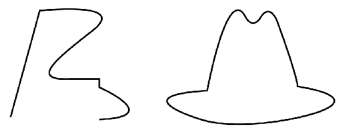
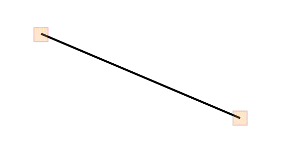
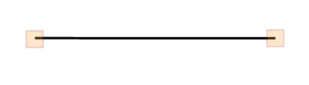
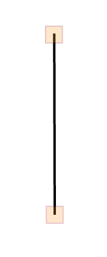
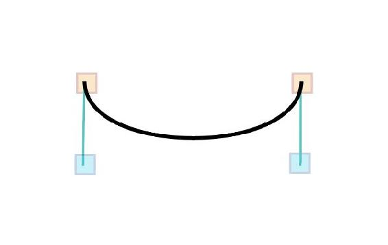
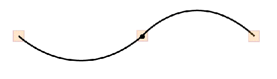
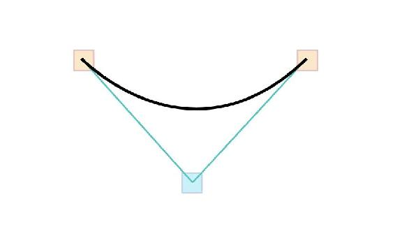
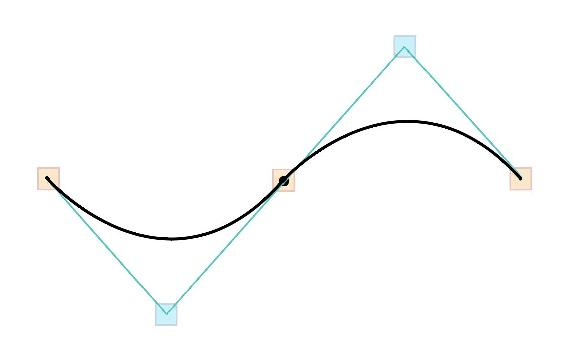
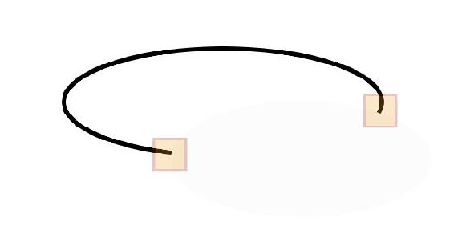

# Group

```markup
<svg viewBox="0 0 218.8 87.1">
 <g fill="none" stroke="#000">
   <path d="M7.3 75L25.9 6.8s58.4-6.4 33.5 13-41.1 32.8-11.2 30.8h15.9v5.5s42.6
     18.8 0 20.6" />
   <path d="M133.1 58.2s12.7-69.2 24.4-47.5c0 0 4.1 8.6 9.5.9 0 0 5-10 10.4.9 0 
     0 12.2 32.6 13.6 43 0 0 39.8 5.4 15.8 15.4-13.2 5.5-53.8 
     13.1-77.4 5.9.1 0-51.9-15.4 3.7-18.6z" />
 </g>
</svg> 
```



## &lt;g&gt; &lt;/g&gt;

* Element **`<g>`** stands for **group**, and it’s a way to nest and assemble multiple elements together in the SVG DOM. 
* You may also define the **`fill`** and **`stroke`** on elements themselves, and can see it applied across the descendants.

## &lt;path /&gt;

* The path begins with **`d`**, for **data**, and is always designated with the **`M`** or **`m`** \(for **moveTo**\) command as the **first value**. This establishes a new point.
* Letters may be **CAPITAL** or **lowercase**. 
* **CAPITAL** letters specify an **absolute coordinate**
* **lowercase** establishes a **relative coordinate**.

| Letter | Meaning | image, where applicable |
| :--- | :--- | :--- |
| **`M`**, **`m`** | moveTo | start of the path |
| **`L`**, **`l`** | lineTo |   |
| **`H`**, **`h`** | Horizontal line drawn from current position |   |
| **`V`**, **`v`** | Vertical line drawn from current position |   |
| **`Z`**, **`z`** | Joins the end of a path to the most recent moveTo command | End of the path |
| \*\*\*\* | **Curve Commands** |  |
| **`C`**, **`c`** | Cubic Bézier |   |
| **`S`**, **`s`** | Reflecting Cubic Bézier |   |
| **`Q`**, **`q`** | Quadratic Bézier - where both sides share same control point |   |
| **`T`**, **`t`** | Command control point that's been reflected |   |
| **`A`**, **`a`** | Elliptical arc |   |


