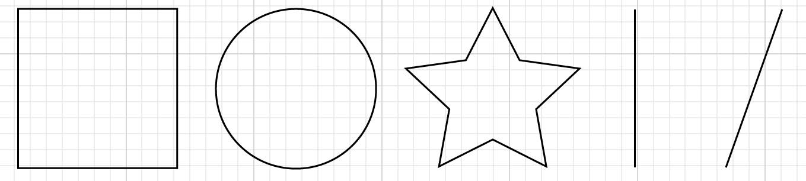
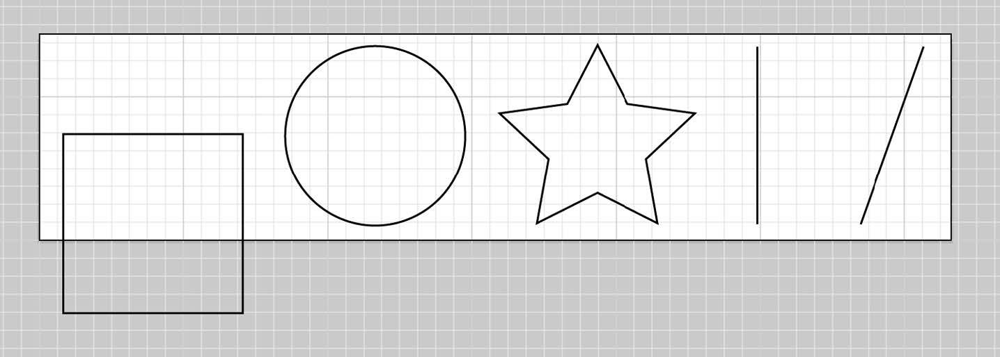

# Introduction

SVG images are scalable, which in an age of increasingly varied viewport sizes is a huge boon to development. With SVG we have one graphic to rule them all that scales to all devices, and therefore can save us from subsequent HTTP requests. Even the newer CSS properties such as srcset and picture require different images to be cut for different viewports, but SVG avoids all of that extra work.

Vector \(rather than raster\) means that, because they are drawn with math, SVGs tend to have greater performance and smaller file sizes.

SVG is an XML file format, and we can use it to succinctly describe shapes, lines, and text while still offering a navigable DOM; this means it can be performant and accessible.

* In a **vector graphics system**, an image is described as a series of geometric shapes. Rather than receiving a finished set of pixels, a vector viewing program receives commands to draw shapes at specified sets of coordinates.
* Vector graphics can be scaled without loss of image quality.

## viewBox

The SVG **`viewBox`**  is a very powerful attribute, as it allows the SVG canvas to truly be infinite, while controlling and refining the viewable space.

parameters: value are as follows: **`x`**, **`y`**, **`width`**, and **`height`**. 

* SVG also stores information outside the viewBox area. If we move a shape outside this space
* The **white area** is what the **viewer sees**, while the white and **gray area** together **hold the information** that the **SVG actually contains**.

