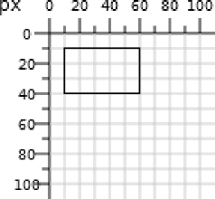

# viewport


**The area of the canvas your document intends to use is called the viewport.**


We define the **size** of this viewport with the **`width`** and **`height`** attributes on the  element.

* Each attribute’s value can be simply a number, which is presumed to be in pixels; 
* this is said to be specified in user coordinates.
* You may also specify width and height as a number followed by a unit identifier, which can be **`em`**, **`rem`**, **`px`** etc
* An  element may also specify its width and height as a **percentage**.
* When the element is nested within another  element, the percentage is measured in terms of the enclosing element.
* If the  element is the root element, the percentage is in terms of the window size.

```markup
<svg width="200" height="150"> 
<svg width="200px" height="150px">
```

* The viewer sets up a coordinate system where the horizontal, or **x-coordinate**, **increases** as you go **to the right**
* the vertical, or **y-coordinate**, **increases** as you move **vertically downward**.
* The upper-left corner of the viewport is defined to have an x- and y-coordinate of 0. This point, written as \(0,0\), is also called the **origin**.

Example,

 viewport 100 pixels wide and 100 pixels high, and then draws a rectangle whose upper-left corner is at coordinate \(10,10\) with a width of 50 pixels and a height of 30 pixels.Figure shows the result, with rulers and a grid to show the coordinate system.



```markup
<svg width="100" height="100">
    <rect x="10" y="10" width="50" height="30"
        style="stroke: black; fill: none;"/>
</svg>
```


